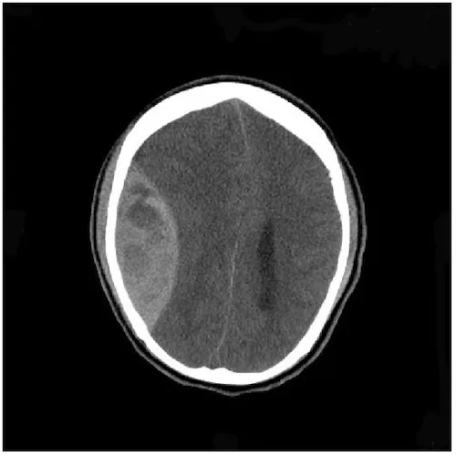
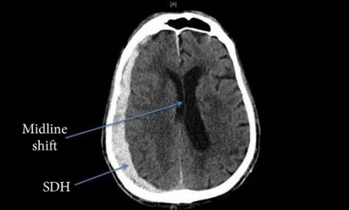
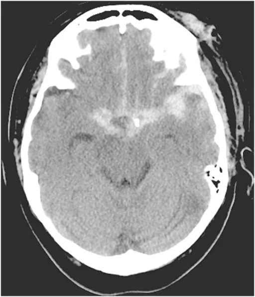

# TBI

*Traumatic Brain Injury*

---

## Types

### Epidural Hematoma (EDH)

- **Definition:** Bleeding between the dura mater and skull
- **Most common source:** Middle meningeal artery
- Often associated with temporal bone fracture
- **CT appearance:** Lentiform / biconvex; does **not** cross midline

!!! tip "Pearl"
    Associated with **"lucid interval"** — initial LOC followed by a period of consciousness, then subsequent coma.

---

### Subdural Hematoma (SDH)

- **Definition:** Bleeding between the dura mater and arachnoid mater
- Most common intracranial hemorrhage
- **Source:** Venous plexus / bridging veins; acceleration/deceleration injury
- **CT appearance:** Crescent-shaped; **crosses midline**

!!! tip "Pearl"
    - Chronic SDH is common in elderly after falls
    - Classic mechanism: acceleration / deceleration injury

---

### Subarachnoid Hemorrhage (SAH)

- **Definition:** Bleeding between the brain and arachnoid mater
- **Causes:**
    - Trauma *(by far #1)*
    - Ruptured aneurysm
    - AVM

!!! tip "Pearls"
    - Aneurysmal bleeds = **"thunderclap" headache**, "worst headache of my life"
    - **Xanthochromia** of CSF is pathognomonic

---

### Diffuse Axonal Injury (DAI)

- **Definition:** Diffuse shearing injury of the brain axons
- **Most common cause:** Rotational force of acceleration/deceleration impact
- May **not** be apparent on CT imaging (low diagnostic yield)
- **MRI appearance:** Punctate hemorrhages; blurring of grey-white interface
- Often identified when CT is insignificant on presentation but patient fails to improve after 6–24 hours → prompts MRI

**Adams Classification:**

| Grade | Description |
|---|---|
| **Grade 1** | Mild — microscopic white matter changes in cerebral cortex, corpus callosum, and brainstem |
| **Grade 2** | Moderate — gross focal lesions in the corpus callosum |
| **Grade 3** | Severe — findings of Grade 1 + additional focal lesions in the brainstem |

!!! warning
    Generally a **poor prognosis**.

---

### Intracerebral Hemorrhage (ICH)

- **Definition:** Bleeding within the brain parenchyma
- **Most common cause:** HTN — chronic HTN weakens walls of small vessels, making them prone to rupture
- **Most common spontaneous HTN areas:** Cerebellum, thalamus, putamen, and pons
- **Other causes:**
    - Aneurysm rupture
    - Cerebral amyloid angiopathy
    - CVM
    - Coagulopathies or anticoagulant medications *(least common)*

---

## See Also

- [ICP](ICP.md)
- [Spinal Cord Pathology and Syndromes](Spinal-Cord-Pathology.md)
- [ICU Notes Overview](index.md)
